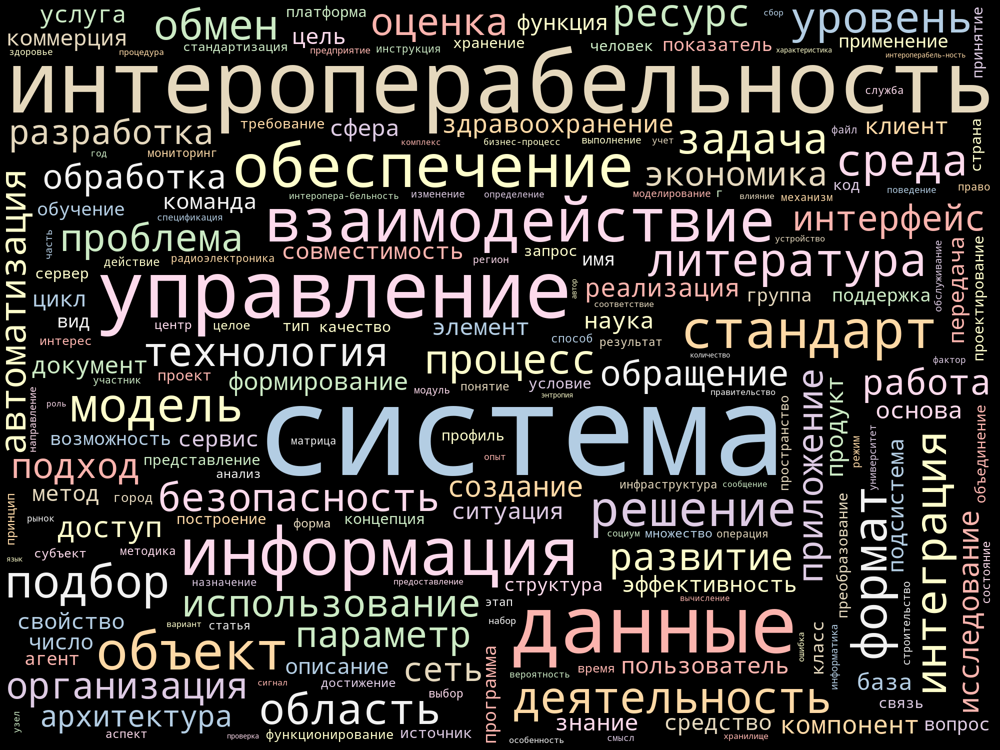

# CyberLeninka Scraper

A Python script to search articles at the [CyberLeninka] digital scientific library.

## Prerequisites

* [Python] version 3.8 or later
* [Pipenv] to install dependencies
* [Docker] with [Docker Swarm] support (needed to run [Selenium Grid])

## Prepare

### Start Selenium Grid

This software uses [Selenium Grid] to download web pages with dynamic HTML. We recommend to start Selenium Grid
with [Docker Swarm] using the `docker-compose.yml` file.

```shell
docker swarm init
docker stack deploy cyberleninka-scraper --compose-file docker-compose.yml
```

Use environment variable `SELENIUM_GRID_URL` to override remote server URL for Selenium. Default server URL
is `http://127.0.0.1:4444/wd/hub`.

To stop Selenium Grid, use the command:

```shell
docker stack rm cyberleninka-scraper
```

### Install dependencies

```
pipenv install
```

## Usage

### Perform search

Example command lines:

```shell
./search-cyberleninka.py семантический веб
./search-cyberleninka.py --log-level=DEBUG JavaScript optimisation
./search-cyberleninka.py миграция сов --output-file=owls.sqlite
```

Suggestion: go into a `pipenv shell` or use `pipenv run ./search-cyberleninka.py` to run the program with required
dependencies.

By default, the program saves results to an SQLite file `articles.sqlite`. At the default log level `INFO` the program
also outputs results to console.

See `./search-cyberleninka.py --help` for help.

### Create tag cloud and list person names

Run the script `analyse.py` and provide keywords for search.

Example:

```shell
./analyse.py --max-articles=10 интероперабельность
```

Example output tag cloud:



[CyberLeninka]: https://cyberleninka.ru/

[Docker]: https://www.docker.com/

[Docker Swarm]: https://docs.docker.com/engine/swarm/

[Pipenv]: https://pipenv.pypa.io/

[Python]: https://www.python.org/

[Selenium Grid]: https://www.selenium.dev/documentation/grid/
